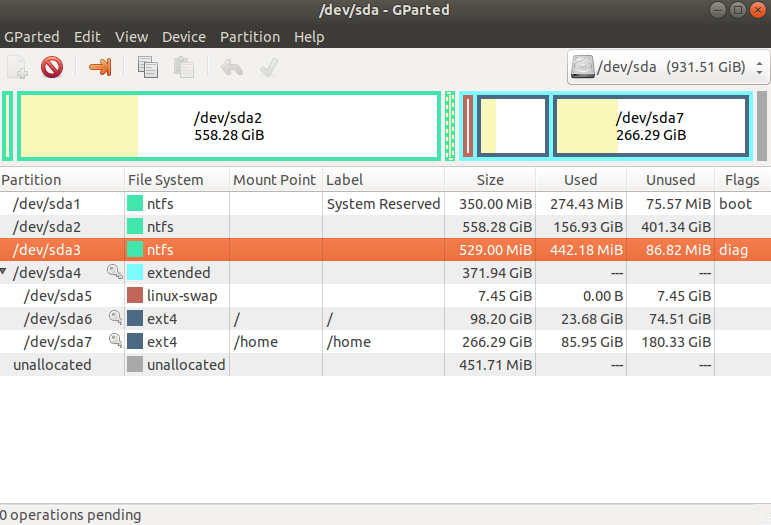

# Dual Boot Ubuntu & Windows
Dual-Booting
: Two operating systems installed on a single PC

Dual booting works by splitting a hard drive with an existing operating system (OS) into multiple [**partitions**](https://www.howtogeek.com/184659/beginner-geek-hard-disk-partitions-explained/) and installing another OS into the newly created partition. Each partition is separate from the others and contained unless specially accessed. Once the computer is dual booting, a boot manager will allow the user to choose which OS to boot at each startup. It's also possible to boot from a portable OS on a portable memory drive with either the boot manager or your Basic Input Output System (BIOS). This guide will cover how to dual boot Windows and the recently released Ubuntu 20.04 LTS in the case where Windows is already installed.

* If you prefer to follow official documentation, here are the [Ubuntu Docs](https://help.ubuntu.com/community/WindowsDualBoot) describing the process. Please note these are dated and not comprehensive.
* If you wish to try Ubuntu before deciding to install, please see [Get Ubuntu](#get-ubuntu) for a bootable Ubuntu USB stick.

## Cost/Benefit
Pros
* Still have access to Windows for gaming or Windows only applications
* Get more out of your hardware, especially for old computers
* Separate Linux environment for work and separate Windows environment for general use
* Access to flexible & powerful Linux commands
* Big advantage to have Linux experience for future computer science education

Cons
* There may be some strange, trivial side effects which will require fixing eg. [discrepancy between Windows and Ubuntu clock](https://askubuntu.com/questions/169376/clock-time-is-off-on-dual-boot)
* Setting up dual booting can be dangerous for your machine if done incorrectly
* Takes up extra hard drive space

## Requirements
* $\ge$ 16 GB USB for a windows recovery drive
* Large USB or external hard drive for system backup
* Windows machine with free $\ge$ 25GB hard drive space
* $\ge$ 4 GB USB stick for Ubuntu Live
* About 4 free hours, dependant on speed of internet & the computer

## Steps
### 1. Back up Windows
#### Create a recovery disk
A recovery disk will allow you to reinstall windows, but not your files or apps, in case of a major problem. Microsoft has a great [walkthrough](https://support.microsoft.com/en-us/help/4026852/windows-create-a-recovery-drive) for this. Note that the process will erase any data previously on the USB.
1. Insert your drive and search for `recovery drive`. 

#### Create a system image backup
A **system image** is a windows 7 feature that creates a perfect copy of partitions you select and is still available in later versions of windows. It can be used to do a complete recovery of windows and your file system. If you do not wish to keep your files, a USB recovery drive  may be all you need. 
1. The system image backup tool is accessible at `Control Panel --> System and Security --> Backup and Restore (Windows 7)`. The option will be listed in the panel on the left side. 

#### Recover your PC
You have recovery options in case something goes wrong. There are a couple useful recovery guides by [HowToGeek](https://www.howtogeek.com/239312/how-to-restore-system-image-backups-on-windows-7-8-and-10/)  and [Microsoft](https://support.microsoft.com/en-us/help/12415/windows-10-recovery-options). Window versions 7+ should come with a recovery environment ([winRE](https://docs.microsoft.com/en-us/windows-hardware/manufacture/desktop/windows-recovery-environment--windows-re--technical-reference)), but you can check if you have it by typing `reagentc /info` on command prompt. You can use it to recover your OS and files with the system image you made. 

**Bootable:** If you're able to boot, [Access winRE](https://docs.microsoft.com/en-us/windows-hardware/manufacture/desktop/windows-recovery-environment--windows-re--technical-reference#entry-points-into-winre) by holding shift while clicking the restart button. Then try some  to try to resolve any issues. 

**Not bootable:** If you can't boot at all, you'll have to use your recovery disk to boot. Follow the method in section [Install Ubuntu](#install-ubuntu) to boot from an external drive. Finally, find and select the `System Image Recovery` option in the and [recover your PC](https://docs.microsoft.com/en-us/previous-versions/windows/it-pro/windows-server-2008-R2-and-2008/cc755163(v=ws.11)?redirectedfrom=MSDN) .

### Prep Windows Partition for Resizing
Resizing your Windows partition will take a long time. Note that defragging may not be necessary if you choose to [repartition with GParted](https://help.ubuntu.com/community/HowtoResizeWindowsPartitions#Defragging) instead of with Windows, but may "[improve the ability to shrink NTFS partitions](https://gparted.org/display-doc.php?name=help-manual&lang=C#gparted-advanced-partition-actions)."

1. [Run CHKDSK](https://www.techjunkie.com/fix-hard-drives-chkdsk-windows-10/) to check your hard drive health and fix errors. 
	1.1 Run Command Prompt or PowerShell as an admin
	1.2 `chkdsk C: /f /r /x` where `C:` is the drive you want to check, `/f` fix errors it encounters, `/r` to recover any data from bad sectors and `/x` unmounts the drive before starting.
2. [Defrag your hard drive](https://www.lifewire.com/how-to-defrag-your-computer-3506876).
	2.1 Search "defrag" or go `Control Panel --> System and Security --> Administrative Tools --> Defrag`

### 3. Get Ubuntu
A bootable Ubuntu USB stick is the easiest way to try or install Ubuntu. The official [guide](https://ubuntu.com/tutorials/tutorial-create-a-usb-stick-on-windows#1-overview) is very clear and thorough. ==flesh this out if extra time==

### 4. Partition with Windows (choose step 4 or 6)
At this point you can choose to repartition with Windows now, or with GParted during the installation. Do your own research as to which is safer or better as there does not seem to be universal agreement. 
1. `Administrative Tools --> Disk Management tool -> Shrink Volume`
2. Choose a [partition scheme](#partition-scheme) and complete repartitioning
3. Restart Windows *twice*
4. Complete [step 5](#install-ubuntu) and install to the newly freed space

### 5. Install Ubuntu
1. Boot from the live Ubuntu USB by restarting your computer. [Access your BIOS settings](https://www.howtogeek.com/129815/beginner-geek-how-to-change-the-boot-order-in-your-computers-bios/) by pressing f2, del, esc or f12 during startup. The correct button is different between computers but it will be displayed on the manufacturer's startup screen. 
2. Follow installation instructions. Choosing the `Minimal installation` option is recommended to avoid bloatware. Continue until the disk partitioning section where you will have either chosen to take [step 4](#partition-with-windows-choose-step-4-or-6) or [step 6](#partition-with-gparted-choose-step-4-or-6).
3. You're done! Continue on with the [next steps!](#next-steps)

### 6. Partition with GParted (choose step 4 or 6)
This [guide](https://askubuntu.com/questions/343268/how-to-use-manual-partitioning-during-installation/343370#343370) has pictures, but the sizes of partitions are outdated.
1. Click on the `Manually edit partition table` option. 
2. Choose a [partition scheme](#partition-scheme) and complete the installation

### Partition Scheme
Ubuntu docs have an [extensive partitioning guide](https://help.ubuntu.com/community/HowtoPartition) and a [good guide](https://help.ubuntu.com/community/DiskSpace) for partition schemes.

#### My Partition Scheme
The partition scheme running in my personal machine can be seen below.

`/dev/sda2` is the main Windows storage partition. The small one to the left is the boot partition, and the small one to the right is the recovery environment. The main storage partition is the only one you want to be resizing. Next, to the left of `/dev/sda6` is the [**swap**](https://help.ubuntu.com/community/SwapFaq) partition which is used to temporarliy store memory from RAM when the RAM is needed elsewhere. `/dev/sda6` is the Ubuntu root partition and `/dev/sda7` is the home directory. Finally, the small grey block on the furthest right is unallocated space. 

#### GPT Disks
Before resizing your partitions, if your hard drive is > 2 TB you may have a GPT disk and need a [BIOS-Boot or EFI partition](https://help.ubuntu.com/community/DiskSpace#BIOS-Boot_or_EFI_partition_.28required_on_GPT_disks.29). You can check if your disk uses GPT by clicking `View --> Device Information` and looking under the `Partition Table` field if you're using GParted, or `Properties --> Volumes --> Partition Style` [using the Windows disk manager](https://www.howtogeek.com/245610/how-to-check-if-a-disk-uses-gpt-or-mbr-and-how-to-convert-between-the-two/).

#### Partition Schemes
Please skim [this guide](https://www.psychocats.net/ubuntu/partitioning) by Psychocats. In particular, the scheme below looks to be ideal except using ext4:
To use this scheme, you would need to use a [program](https://www.howtogeek.com/112888/3-ways-to-access-your-linux-partitions-from-windows/) in Windows to access the ext4 storage, but you would be able to access the same files from both Windows and Linux. I have not tested this scheme, but I wish I knew about it earlier as having seperate storage between Windows and Linux with my scheme is a real limitation. Having a seperage `/home` partition will allow you to easily re-install Ubuntu without affecting your files.

#### Partition Sizes
Choosing the right partition sizes for your machine mainly depends on how much space you have available to allocate. 

Microsoft recommends [minimum 32 GB](https://docs.microsoft.com/en-us/windows-hardware/design/minimum/minimum-hardware-requirements-overview#331-storage-device-size) for Windows 10, version 1903 and up, but realistically, 70+ GB is required and [**at least 128 GB on a SSD**](https://winaero.com/blog/the-real-system-requirements-for-windows-10/) is recommended by some users. 

Ubuntu needs [minimum 8 GB](https://help.ubuntu.com/community/DiskSpace#Root_partition_.28always_required.29) and recommends 15 GB, but in reality needs between **30 - 40 GB**. 

The swap partition should be around:  $$\textsf{round}(\sqrt{\textsf{Size of RAM in GB}})$$ according to [Ubuntu recommendations](https://help.ubuntu.com/community/SwapFaq#How_much_swap_do_I_need.3F). If you feel like you need more later, you may need to upgrade your RAM instead.

Finally, your storage space should take up whatever space is remaining.

## Next Steps
* [Learn Linux basics](linux_basics.md)
* [Setup Selkirk work environment](work_environment.md)
